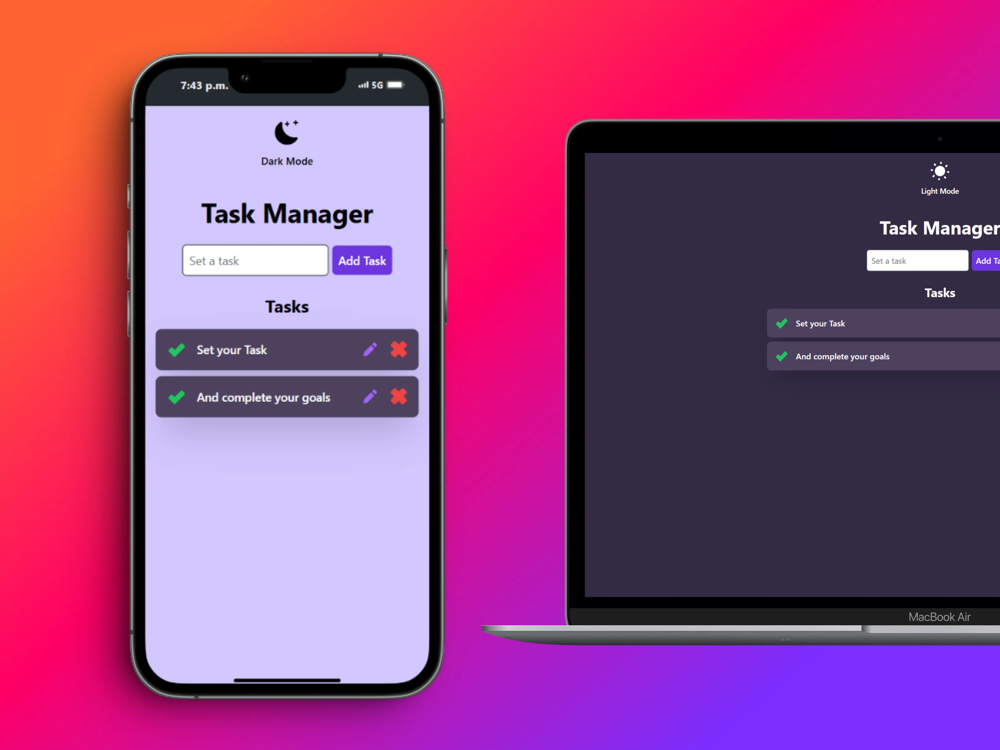
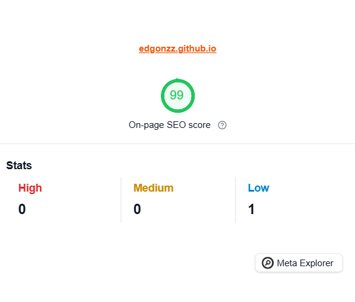

<a name="readme-top"></a>




# Task Manager 

Task Manager is a simple web application for managing tasks, developed during the <a href="https://platzi.com/cursos/document-object-model/" target="_blank">Curso de JavaScript: Manipulación del DOM</a> on **Platzi**. The project demonstrates DOM manipulation using JavaScript and implements the LocalStorage API for data persistence.

## Improvements
<div align="center">
  <a target="_blank" href="https://googlechrome.github.io/lighthouse/viewer/?gist=c4f6390b527bf2ff5962fc0e7f610dcc" target="_blank">
    
  </a>
</div>

In this project, I made several improvements, including:

* Design Enhancements: Replaced manual styles with TailwindCSS for faster and cleaner development.
* New Features: Added a task completion mode with data persistence using LocalStorage.
* SEO Improvements: Enhanced meta tags and implemented Open Graph for better sharing capabilities.
* UI Updates: Improved the theme toggle button for a smoother user experience.

## 🛠️ Technologies Used

* [HTML](https://developer.mozilla.org/en-US/docs/Web/HTML): For structuring the web application.
* [Tailwind CSS](https://tailwindcss.com/): To style the application quickly and efficiently.
* [JavaScript](https://developer.mozilla.org/en-US/docs/Web/JavaScript): For dynamic DOM manipulation and interaction.
<p align="right">(<a href="#readme-top">Back to top</a>)</p>


## Installation

1. Clone the repository to your local machine:

   ```bash
   git clone https://github.com/EdGonzz/taskManager.git
   ```

2. Navigate to the project directory:

   ```bash
   cd taskManager
   ```

3. Install the project dependencies:

   ```bash
   npm install
   ```

4.  If you plan to modify the project, use the command `npm run dev` to start a development server and ensure TailwindCSS updates correctly in `tailwind.config.js`.

<p align="right">(<a href="#readme-top">Back to top</a>)</p>

## Usage

Navigate to the project URL [here](https://edgonzz.github.io/taskManager/) to see the page in operation.
<p align="right">(<a href="#readme-top">Back to top</a>)</p>

## Contribution

1. Fork the project.
2. Create a new branch for your changes (`git checkout -b my-new-branch`)
3. Make your changes and commit (`git commit -am 'Add new feature'`)
4. Test your changes locally to ensure everything works as expected.
5. Push the branch (`git push origin my-new-branch`)
6. Open a Pull Request.
<p align="right">(<a href="#readme-top">Back to top</a>)</p>

## License

This project is licensed under the MIT License. See the [LICENSE](./LICENSE) file for more details.
<p align="right">(<a href="#readme-top">Back to top</a>)</p>


## Authors

- [Edwin Contreras](https://github.com/EdGonzz)
<p align="right">(<a href="#readme-top">Back to top</a>)</p>